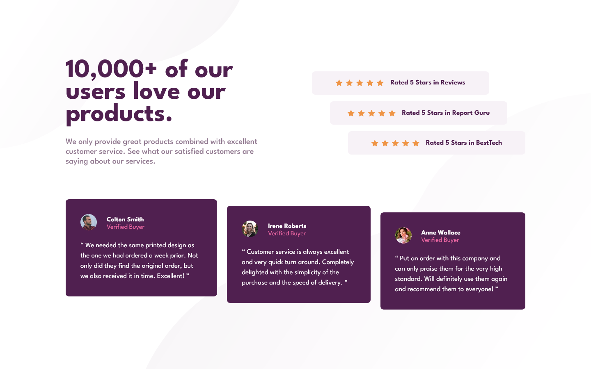

# Frontend Mentor - Social proof section solution

This is a solution to the [Social proof section challenge on Frontend Mentor](https://www.frontendmentor.io/challenges/social-proof-section-6e0qTv_bA). Frontend Mentor challenges help you improve your coding skills by building realistic projects. 

## Table of contents

- [Overview](#overview)
  - [The challenge](#the-challenge)
  - [Screenshot](#screenshot)
  - [Links](#links)
- [My process](#my-process)
  - [Built with](#built-with)
  - [What I learned](#what-i-learned)
  - [Continued development](#continued-development)
- [Author](#author)

## Overview

### The challenge

Users should be able to:

- View the optimal layout for the section depending on their device's screen size

### Screenshot

### Links

- Solution URL: [GitHub](https://github.com/mbdelarosa/social-proof-section)
- Live Site URL: [Social Proof Section](https://mbdelarosa.github.io/social-proof-section)

## My process

### Built with

- Semantic HTML5 markup
- CSS custom properties
- Flexbox
- CSS Grid
- Mobile-first workflow
- BEM

### What I learned

Did this challenge to practice my usage of grid and flexbox, working mobile-first to make sure the solution is responsive across different screen sizes. Other learnings from this challenge:
	- Use of two background images with own positioning and properties
	- Profile photos should have an alt text with the customer's name
	- Alignment of flex items

### Continued development

Would like to continue practicing usage of grid and flexbox, as well as the use of `clamp` to make font sizes also responsive

## Author

- Frontend Mentor - [@mbdelarosa](https://www.frontendmentor.io/profile/mbdelarosa)